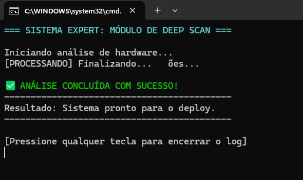

# ScannerExpert

## Descrição
Este projeto foi desenvolvido em .NET com o objetivo de demonstrar, na prática, a aplicação da 1ª Heurística de Nielsen: Visibilidade do Status do Sistema.

A aplicação simula um fluxo simples onde o sistema fornece feedback contínuo ao usuário durante sua execução.

## Objetivo
Demonstrar como a visibilidade do status do sistema melhora a experiência do usuário, mantendo-o sempre informado sobre o que está acontecendo.

## Heurística Aplicada
1ª Heurística de Nielsen - Visibilidade do Status do Sistema

O sistema deve sempre manter o usuário informado sobre o que está acontecendo, por meio de feedback claro e em tempo adequado.

## Estrutura do Projeto
- Program.cs: Contém a lógica principal da aplicação e exibição das mensagens de status.

## Exemplo de Execução

## Conclusão
A aplicação demonstra a importância do feedback contínuo ao usuário. A visibilidade do status do sistema reduz incertezas e melhora significativamente a usabilidade.
